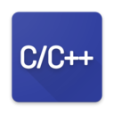

# C/C++ Project Generator

Create C/C++ projects

## Features

Project will generate the following:

Project structure: Common folders like src, include and bin
Makefile: A makefile already set up to build and run your project
VSCode task: Configurations for building and running your project

## Requirements

* If you are on linux you must install gcc and make
* If you are on window you must install mingw

## How to use
* Go to command pallete (usually : ctrl + shift + p)
* Search for "Create C project" or "Create c++ project" depending on your preference
* Select the folder where the project should be created
* That's it, project will open

## Release Notes

Refer to [CHANGELOG](CHANGELOG.md)

## Donation

If you like this extension, you can donate via **[PayPal](https://www.paypal.me/danielpinto8zz6)**. It will help me to spend more time improving this!
